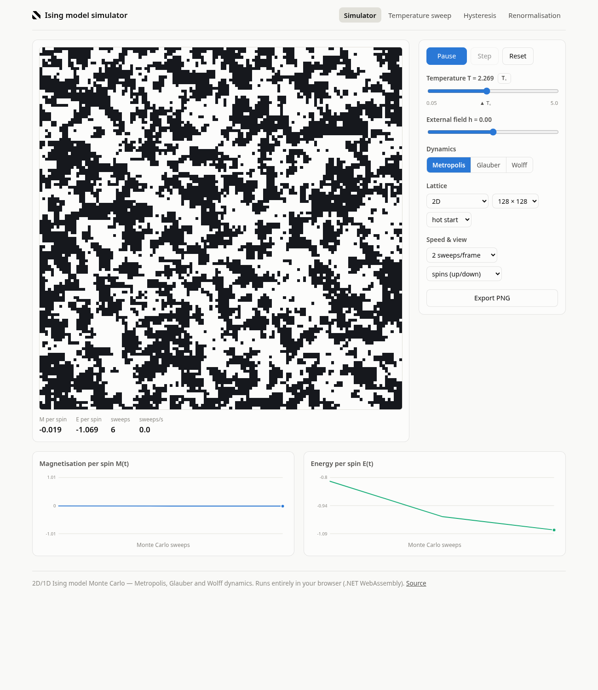
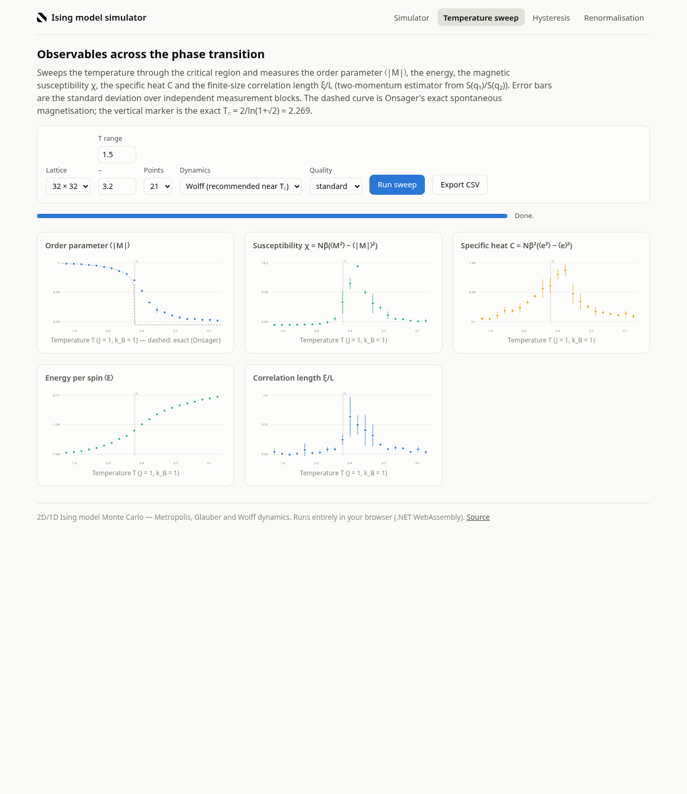

# Ising Simulator

Monte Carlo simulation of the Ising model in 1D and 2D, with an interactive
web app that runs entirely in the browser.

**Live demo: <https://francisco-kim.github.io/IsingSimulator/>**

| Interactive simulator | Observables across the transition |
|---|---|
|  |  |

## The physics

The Ising model on a hypercubic lattice with periodic boundary conditions:

```
E = J Σ_<ij> s_i s_j  −  h Σ_i s_i ,      s_i = ±1
```

> **Sign convention.** This repository writes the bond term **without** the
> conventional leading minus sign, so the ferromagnet corresponds to
> **J = −1** (used throughout). `Fast2DIsingMonteCarloSimulator` is the one
> exception: it hard-codes the opposite (J = +1 ferromagnet) convention.

In 2D the model has the exactly known critical point (Onsager, 1944):

- **T꜀ = 2 / ln(1 + √2) ≈ 2.2692** (in units of |J|/k_B),
- spontaneous magnetisation **M(T) = (1 − sinh(2/T)⁻⁴)^(1/8)** for T < T꜀,

both of which are drawn as exact references in the web app's sweep page.
In 1D there is no finite-temperature transition (T꜀ = 0); the exact energy
per spin, E/N = −tanh(1/T), is easy to check against the simulator.

### Monte Carlo algorithms

- **Metropolis** — accept a single-spin flip with probability min(1, e^(−βΔE)).
- **Glauber** — accept with probability 1/(1 + e^(βΔE)).
- **Wolff single-cluster** — grow a cluster of aligned spins with bond
  probability 1 − e^(−2β|J|) and flip it as a whole; no critical slowing-down
  near T꜀. Only valid at h = 0.

### Observables

Per measurement block the library computes the magnetisation M, |M|, M², the
energy per spin, and

- **susceptibility** χ = Nβ(⟨M²⟩ − ⟨|M|⟩²),
- **specific heat** C = Nβ²(⟨e²⟩ − ⟨e⟩²),
- **correlation length** from the structure factor at the two smallest
  momenta, q₁ = 2π/L and q₂ = 2q₁, assuming the Ornstein–Zernike form
  S(q) ∝ 1/(q² + ξ⁻²):

  ```
  ξ = (1/q₁) √[ (S(q₁)/S(q₂) − 1) / (4 − S(q₁)/S(q₂)) ]
  ```

  This two-momentum estimator needs no fitting, avoids the disconnected
  (q = 0) magnetisation contribution on both sides of the transition, and
  feeds directly into the finite-size-scaling quantity ξ/L.

Error bars are standard deviations over independent repetition blocks (the
accumulators are reset between blocks).

## Repository layout

```
src/IsingMonteCarlo/    class library — the physics
  Representations/        lattice, Hamiltonian, Metropolis/Glauber/Wolff dynamics,
                          IsingMonteCarloSimulator (observables), fast 2D path
  Services/               thermalisation + measurement runs, T-range sweeps,
                          block-spin renormalisation (3×3 majority rule)
  Helpers/                lattice initialisation, file I/O, PNG rendering (ImageSharp)
src/IsingSimulator/     interactive console app (menu-driven)
src/IsingWeb/           Blazor WebAssembly app (the live demo)
tests/                  xUnit physics sanity tests
```

## Getting started

Requires the [.NET 10 SDK](https://dotnet.microsoft.com/download).

```bash
# Run the physics tests
dotnet test

# Run the console app (menu-driven; writes lattices/measurements under data/)
dotnet run --project src/IsingSimulator

# Run the web app locally, then open the printed localhost URL
dotnet run --project src/IsingWeb
```

### Web app

Everything runs client-side in WebAssembly — no server, no data leaves the
browser. Pages:

- **Simulator** — live 2D lattice (64²–512²) or 1D spacetime diagram;
  play/pause/step; temperature and field sliders (quench and anneal live);
  Metropolis/Glauber/Wolff switch with optional Wolff-cluster highlighting;
  domain colouring; live M(t) and E(t) charts; PNG export.
  Append `?autorun` to the URL to start the simulation on load.
- **Temperature sweep** — ⟨|M|⟩, χ, C, ⟨E⟩ and ξ/L across the critical
  region with error bars, the exact M(T) overlay and the T꜀ marker; CSV export.
- **Hysteresis** — triangle-wave field drive below T꜀ tracing the M–h loop.
- **Renormalisation** — repeated 3×3 majority-rule block-spin steps at,
  below and above T꜀ (scale invariance at criticality).

### Console app

The console app drives long simulations and file workflows: thermalising
large lattices (up to 19683²) with checkpointing to `data/{L}/`, observable
measurements across temperature ranges (Mathematica-friendly output under
`data/{L}/measurements/`), PNG snapshots, and block-spin renormalisation /
zoom image sequences. Lattice files are named
`{L}_{T:0.00000}_{iterations}.bin|.dat`.

## Deployment

Pushes to `main` trigger `.github/workflows/deploy-pages.yml`, which runs the
tests, publishes the web app with AOT compilation, rewrites the
`<base href>` for project-pages hosting and deploys it to GitHub Pages at
`francisco-kim.github.io/IsingSimulator/`.
(One-time repo setting: *Settings → Pages → Source: GitHub Actions*.)

## References

- L. Onsager, *Crystal statistics I*, Phys. Rev. **65**, 117 (1944).
- U. Wolff, *Collective Monte Carlo updating for spin systems*,
  Phys. Rev. Lett. **62**, 361 (1989).
- M. E. J. Newman & G. T. Barkema, *Monte Carlo Methods in Statistical
  Physics*, Oxford University Press (1999).

## License

See [LICENSE.txt](LICENSE.txt).
